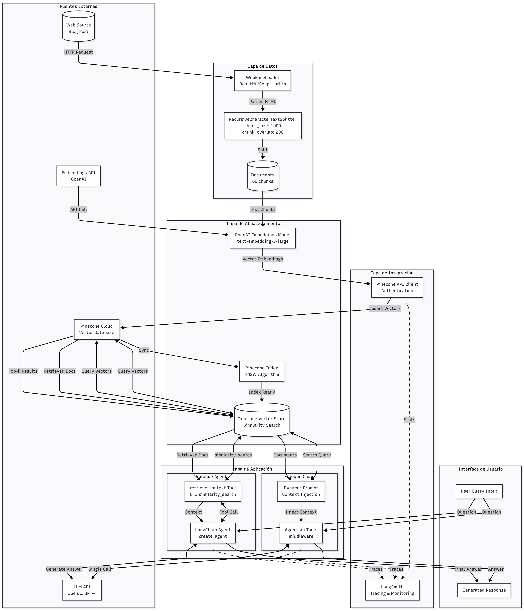
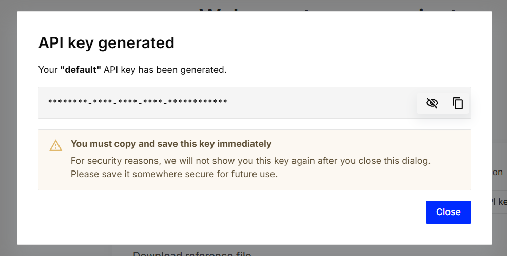
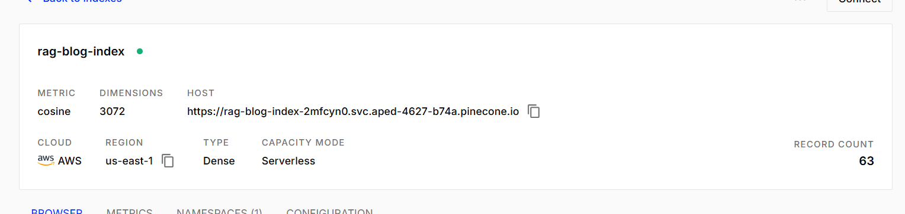
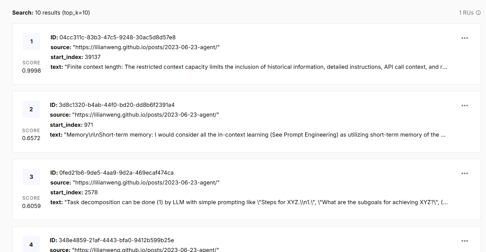

# Taller 8 - RAG (Retrieval-Augmented Generation) 

## Descripción del Proyecto

Este proyecto implementa un sistema RAG (Retrieval-Augmented Generation) utilizando LangChain y OpenAI. RAG es una técnica que combina la recuperación de información relevante de una base de conocimiento con la generación de respuestas mediante modelos de lenguaje grandes (LLM), permitiendo que el modelo proporcione respuestas más precisas y contextuales basadas en información específica.

## Arquitectura y Componentes

### Diagrama de Arquitectura



### Componentes Principales

#### 1. **Cargador de Documentos **
- **Propósito**: Extraer contenido 
- **Tecnología**: BeautifulSoup4 (bs4)
- **Configuración**: Extrae únicamente título, encabezados y contenido del post

#### 2. **Divisor de Texto (RecursiveCharacterTextSplitter)**
- **Propósito**: Dividir documentos largos en fragmentos manejables
- **Parámetros**:
  - `chunk_size`: 1000 caracteres
  - `chunk_overlap`: 200 caracteres (para mantener contexto)
  - `add_start_index`: True (rastrea posición original)
- **Resultado**: 63 sub-documentos del blog post original

#### 3. **Modelo de Embeddings (OpenAI Embeddings)**
- **Modelo**: `text-embedding-3-large`
- **Propósito**: Convertir texto en vectores numéricos de alta dimensionalidad
- **Función**: Permite comparar semánticamente diferentes textos

#### 4. **Almacén Vectorial (Pinecone Vector Database)**
- **Tipo**: Base de datos vectorial en la nube (Pinecone)
- **Propósito**: Almacenar y buscar eficientemente embeddings de documentos de forma persistente
- **Funcionalidad**: Búsqueda por similitud usando distancia coseno
- **Ventajas**: Persistencia, escalabilidad, y velocidad optimizada para producción
- **Configuración**: Índice serverless en AWS con dimensión 3072

#### 5. **Sistema de Recuperación (Retrieval Tool)**
- **Implementación**: Herramienta personalizada usando decorador `@tool`
- **Método**: Búsqueda por similitud (`similarity_search`)
- **Parámetros**: k=2 (recupera los 2 documentos más similares)

#### 6. **Agente de IA (LangChain Agent)**
- **Modelo base**: GPT-4.1 de OpenAI
- **Configuración**: Dos enfoques implementados
  - **Enfoque 1**: Agente con herramienta de recuperación explícita
  - **Enfoque 2**: Agente con middleware de inyección de contexto dinámico

#### 7. **Middleware de Contexto Dinámico**
- **Propósito**: Inyectar automáticamente contexto relevante en las consultas
- **Funcionamiento**: Recupera documentos similares y los agrega al mensaje del sistema
- **Ventaja**: Simplifica el flujo sin necesidad de tools explícitas

## Requisitos Previos

- Python 3.8 o superior
- Cuenta de OpenAI con API Key
- **Cuenta de Pinecone con API Key** (para base de datos vectorial)
- (Opcional) Cuenta de LangSmith para tracing y debugging

## Instalación

### 1. Clonar el Repositorio

```bash
git clone https://github.com/CamilaTorres08/taller8_AREP_rag.git
cd taller8_AREP_rag
```

### 2. Crear Entorno Virtual

**Windows:**
```bash
python -m venv .venv
.venv\Scripts\activate
```

**Linux/Mac:**
```bash
python3 -m venv .venv
source .venv/bin/activate
```

### 3. Instalar Dependencias

Todas las dependencias necesarias se pueden instalar ejecutando las celdas del notebook, o manualmente:

```bash
pip install langchain langchain-text-splitters langchain-community bs4
pip install langchain-openai
pip install langchain-core
pip install python-dotenv
pip install pinecone-client langchain-pinecone
```

#### Lista Completa de Dependencias

- `langchain`: Framework principal para construir aplicaciones con LLM
- `langchain-openai`: Integración con OpenAI
- `langchain-text-splitters`: Utilidades para dividir texto
- `langchain-community`: Componentes de la comunidad (WebBaseLoader)
- `langchain-core`: Componentes core de LangChain
- `langchain-pinecone`: Integración de LangChain con Pinecone
- `pinecone-client`: Cliente oficial de Pinecone para Python
- `bs4` (BeautifulSoup4): Parsing de HTML
- `python-dotenv`: Manejo de variables de entorno

## Configuración

### 1. Configurar Variables de Entorno

Crear un archivo `.env` en la raíz del proyecto:

```env
OPENAI_API_KEY=tu-api-key-aqui
PINECONE_API_KEY=tu-pinecone-api-key-aqui
LANGSMITH_API_KEY=tu-langsmith-key-aqui (opcional)
LANGSMITH_TRACING=true (opcional)
```

### 2. Obtener API Keys

**OpenAI API Key:**
1. Visitar [https://platform.openai.com/api-keys](https://platform.openai.com/api-keys)
2. Crear una nueva API key
3. Copiar y guardar en el archivo `.env`

**Pinecone API Key:**
1. Visitar [https://www.pinecone.io/](https://www.pinecone.io/)
2. Crear una cuenta gratuita (incluye índice serverless gratis)
3. Ir a [https://app.pinecone.io/](https://app.pinecone.io/)
4. Generar una API key desde el dashboard
5. Copiar y guardar en el archivo `.env`



**LangSmith API Key (Opcional):**
1. Visitar [https://smith.langchain.com/](https://smith.langchain.com/)
2. Crear una cuenta y generar API key
3. Útil para debugging y tracing de las llamadas


### 3. Verificar Configuración

El notebook carga automáticamente las variables de entorno usando:

```python
from dotenv import load_dotenv
import os

load_dotenv()
api_key = os.getenv("OPENAI_API_KEY")
```

## Uso

### Ejecutar el Notebook

1. Abrir Jupyter Notebook o Jupyter Lab:
```bash
jupyter notebook
```

2. Navegar a `taller8.ipynb`

3. Ejecutar las celdas secuencialmente (Shift + Enter)

### Flujo de Ejecución

#### Paso 1: Instalación de Dependencias (Celdas 0-7)
Instala todas las bibliotecas necesarias.

#### Paso 2: Configuración de Credenciales (Celdas 1, 4, 6)
Configura las API keys y el modelo de lenguaje.

#### Paso 3: Inicialización de Componentes (Celdas 8)
Crea el vector store en memoria.

#### Paso 4: Carga y Procesamiento de Documentos (Celdas 9-11)
```python
# Resultado esperado:
# Total characters: 43047
# Split blog post into 63 sub-documents.
```

#### Paso 5: Indexación de Documentos (Celda 12)
Agrega los documentos al vector store y genera embeddings.

#### Paso 6: Creación del Agente con Tool (Celdas 13-15)
Implementa un agente que usa una herramienta de recuperación explícita.

**Ejemplo de consulta:**
```python
query = (
    "What is microservices?\n\n"
    "Once you get the answer, look up common extensions of that method."
)
```

#### Paso 7: Agente con Middleware Dinámico (Celdas 16-17)
Implementa un enfoque más elegante con inyección automática de contexto.

**Ejemplo de consulta:**
```python
query = "What is microservices?"
```

## Ejemplos de Ejecución

### Ejemplo 1: Consulta sobre Agentes de IA

```python
query = "What are the key components of an LLM-powered agent?"

for step in agent.stream(
    {"messages": [{"role": "user", "content": query}]},
    stream_mode="values",
):
    step["messages"][-1].pretty_print()
```

**Respuesta esperada:**
El agente buscará información relevante del blog post sobre agentes autónomos y proporcionará una respuesta detallada sobre componentes como Planning, Memory y Tool Use.

### Ejemplo 2: Consulta sobre Conceptos Específicos

```python
query = "Explain ReAct prompting"

for step in agent.stream(
    {"messages": [{"role": "user", "content": query}]},
    stream_mode="values",
):
    step["messages"][-1].pretty_print()
```

**Respuesta esperada:**
El sistema recuperará fragmentos del documento que mencionen ReAct y generará una explicación contextualizada.

## Estructura del Proyecto

```
taller8_AREP_rag/
│
├── .venv/                  # Entorno virtual (no incluido en git)
├── taller8.ipynb          # Notebook principal con implementación
├── .env                   # Variables de entorno (no incluido en git)
├── .gitignore            # Archivos ignorados por git
└── README.md             # Este archivo
```

## Conceptos Clave Implementados

### 1. RAG (Retrieval-Augmented Generation)
Técnica que mejora las respuestas de LLM mediante:
- **Retrieval**: Búsqueda de información relevante en una base de conocimiento
- **Augmentation**: Enriquecimiento del prompt con contexto recuperado
- **Generation**: Generación de respuesta usando el LLM con contexto adicional

### 2. Embeddings
Representaciones vectoriales de texto que capturan significado semántico:
- Textos similares tienen vectores cercanos
- Permite búsqueda por similitud semántica
- Modelo usado: `text-embedding-3-large` (OpenAI)

### 3. Vector Store (Pinecone)
Base de datos especializada en almacenar y buscar vectores:
- Búsqueda eficiente por similitud usando distancia coseno
- **Implementación en la nube con Pinecone** para persistencia y escalabilidad
- Arquitectura serverless que escala automáticamente
- Índices optimizados para millones de vectores

### 4. Text Splitting
División inteligente de documentos largos:
- Mantiene coherencia semántica
- Overlap para no perder contexto entre chunks
- Optimiza tamaño para embeddings y recuperación

### 5. LangChain Agents
Sistemas de IA que pueden:
- Razonar sobre qué acciones tomar
- Usar herramientas (tools) para obtener información
- Generar respuestas basadas en múltiples pasos de razonamiento

## Migración a Pinecone

### ¿Por qué migrar de InMemoryVectorStore a Pinecone?

La versión original del proyecto utilizaba `InMemoryVectorStore`, que es excelente para prototipado pero tiene limitaciones:

**Limitaciones de InMemoryVectorStore:**
- Los vectores se pierden al reiniciar el notebook
- No escala para grandes volúmenes de datos
- Limitado por la memoria RAM disponible
- No es adecuado para producción

**Ventajas de Pinecone:**
- Almacenamiento persistente en la nube
- Escalabilidad automática (millones de vectores)
- Latencia ultra-baja (< 100ms)
- Arquitectura serverless (sin gestión de infraestructura)
- Plan gratuito generoso para desarrollo

### Cambios realizados respecto al tutorial

**Antes (InMemoryVectorStore):**
```python
from langchain_core.vectorstores import InMemoryVectorStore
vector_store = InMemoryVectorStore(embeddings)
```

**Ahora (Pinecone):**
```python
from pinecone import Pinecone, ServerlessSpec
from langchain_pinecone import PineconeVectorStore

pc = Pinecone(api_key=os.environ.get("PINECONE_API_KEY"))
index_name = "rag-blog-index"

# Crear índice si no existe
if index_name not in pc.list_indexes().names():
    pc.create_index(
        name=index_name,
        dimension=3072,
        metric="cosine",
        spec=ServerlessSpec(cloud="aws", region="us-east-1")
    )

# Inicializar vector store
vector_store = PineconeVectorStore(
    index_name=index_name,
    embedding=embeddings
)
```





## Ventajas del Sistema RAG con Pinecone

1. **Respuestas Más Precisas**: Basadas en información específica del dominio
2. **Reducción de Alucinaciones**: El modelo se basa en contexto real recuperado de la base de datos
3. **Actualizable**: Se puede agregar nueva información sin reentrenar el modelo
4. **Trazabilidad**: Las respuestas pueden citar fuentes específicas de los documentos
5. **Eficiencia**: No requiere fine-tuning costoso del LLM
6. **Persistencia**: Los vectores se almacenan permanentemente en Pinecone (no se pierden al reiniciar)
7. **Escalabilidad**: Pinecone maneja millones de vectores con búsquedas en milisegundos
8. **Producción Lista**: Arquitectura serverless optimizada para aplicaciones reales

## Referencias

- [LangChain RAG Tutorial](https://python.langchain.com/docs/tutorials/rag/)
- [OpenAI API Documentation](https://platform.openai.com/docs/)
- [Pinecone Documentation](https://docs.pinecone.io/)
- [LangChain Pinecone Integration](https://python.langchain.com/docs/integrations/vectorstores/pinecone/)

## Autor

**Andrea Camila Torres González**

